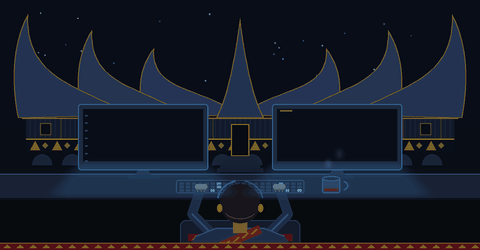
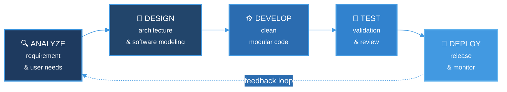

<!-- BANNER  -->
<p align="center">
  
</p>

<h1 align="center">
  Hello World!, I'm Fauzein
  
</h1>

<p align="center">
  <b>Software Engineer</b> &nbsp;·&nbsp; <i>Backend focused</i> &nbsp;·&nbsp; <i>I design requirements before I write code</i>
</p>

<!-- TYPING EFFECT -->
<p align="center">
  <a href="https://YOUR_PORTFOLIO">
    
  </a>
</p>

<!-- ABOUT -->
<table border="0">
<tr>
<td width="62%" valign="top">

## `>` About Me
I'm a **Software Engineer** who enjoys building software based on real **user needs** and **requirements**, while ensuring **quality** to deliver a great user experience. My main focus is **Backend Development**, working with APIs, data models, and the logic behind the screen.

I work across the SDLC, from requirements engineering and software modeling to implementation and testing, including black-box and white-box testing, both manually and automation.

Currently, I’m interested in exploring 🔍 **Systems Analysis** and 🚀 **DevOps** 

```php
<?php

$fauzein = [
    'name'      => 'Fauzein Mulya Warman',
    'role'      => 'Backend Developer',
    'education' => 'Bachelor of Software Engineering',
    'location'  => 'Indonesia',
    'interest'  => ['Backend Developer', 'System Analysis', 'DevOps', 'Software Testing],
];
```

### `>` Connect with Me

<a href="https://linkedin.com/in/fauzeinmw2" target="_blank">
  
</a>
&nbsp;
<a href="https://instagram.com/fauzein_mw_02" target="_blank">
  
</a>
&nbsp;
<a href="mailto:fauzeinmw2@gmail.com">
  
</a>

</td>
</tr>
</table>


<!-- TECH STACK -->
## `>` Tech Stack & Currently I'm Using

<table>
  <tr>
    <td valign="middle" width="22%"><b>Languages</b></td>
    <td>
      
    </td>
  </tr>
  <tr>
    <td valign="middle"><b>Frameworks</b></td>
    <td>
      
    </td>
  </tr>
  <tr>
    <td valign="middle"><b>Database</b></td>
    <td>
      
    </td>
  </tr>
  <tr>
    <td valign="middle"><b>Tools</b></td>
    <td>
      
    </td>
  </tr>
</table>


<!-- SDLC DIAGRAM -->
## `>` How I Build Software



<table>
  <tr>
    <td align="center" width="20%"><code>01 · ANALYZE</code></td>
    <td align="center" width="20%"><code>02 · DESIGN</code></td>
    <td align="center" width="20%"><code>03 · DEVELOP</code></td>
    <td align="center" width="20%"><code>04 · TEST</code></td>
    <td align="center" width="20%"><code>05 · DEPLOY</code></td>
  </tr>
  <tr>
    <td align="center"><sub>Turn user needs into requirements you can measure</sub></td>
    <td align="center"><sub>Shape the architecture, data schema, and modeling before coding</sub></td>
    <td align="center"><sub>Write code that stays modular, consistent, and documented</sub></td>
    <td align="center"><sub>Validate through testing and code review</sub></td>
    <td align="center"><sub>Release & improve</sub></td>
  </tr>
</table>

<!-- CONTACT -->
<div align="center">

<sub><i>"From a software process perspective, <br> requirements engineering is a major software engineering action <br> that begins during the communication activity and continues into the modeling activity"</i></sub><br />
<sub><b>— Roger S. Pressman</b>, <i>Software Engineering: A Practitioner's Approach</i></sub>

</div>
